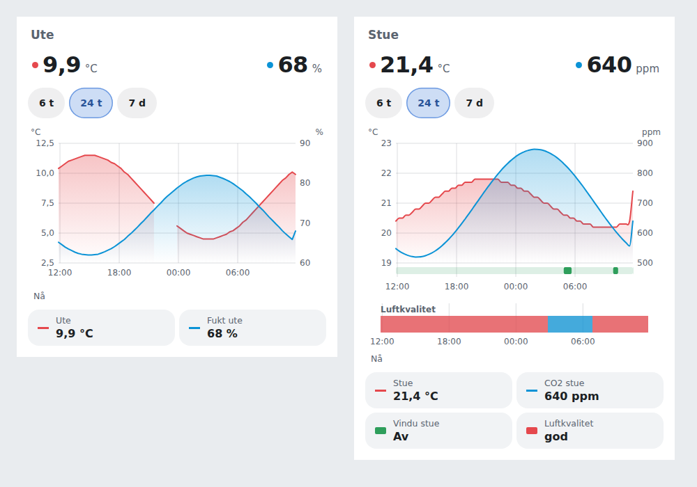
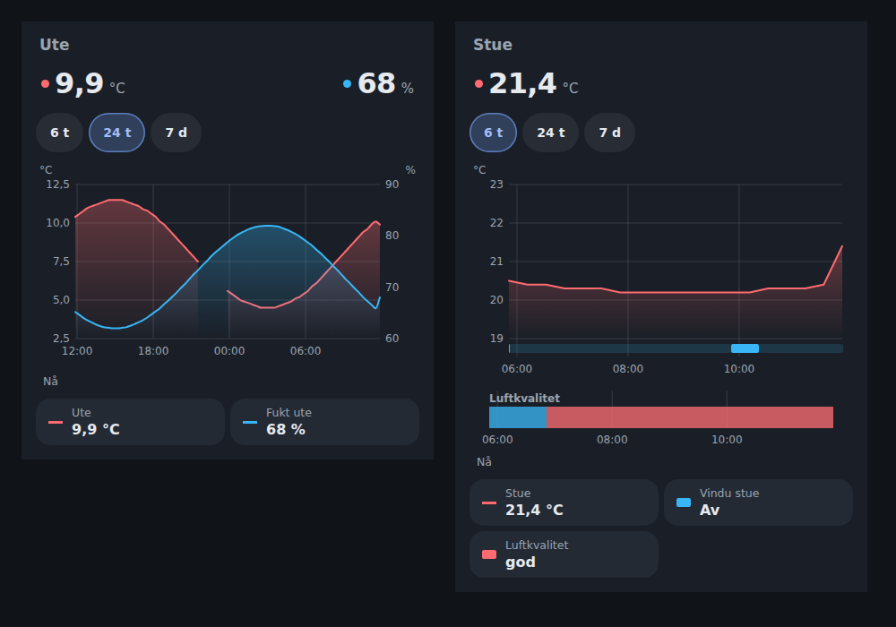

# History Card

A history chart for any Home Assistant entities, from the recorder: measurements
as lines on up to two scales with a translucent fill, on/off entities such as
windows, doors and locks as lanes under them, and other states as a timeline.
The same code is the shared history view of our other cards, so every card's
history looks and works alike.





The images use the built card with simulated data.

## Install

Add this repository to HACS as a **Dashboard** repository, install **History
Card**, and refresh the browser. For manual installation, copy
`dist/lovelace-card-history.js` to `www/` and add it as a JavaScript module
resource.

## Configuration

Everything below is in the card's visual editor.

```yaml
type: custom:lovelace-card-history
title: Ute
entities:
  - sensor.outdoor_temperature
  - entity: sensor.outdoor_humidity
    name: Fukt ute
  - binary_sensor.living_room_window
  - sensor.air_quality
hours: 24          # the range shown first: 6, 24 or 168
show_current: true # the first two measurements' current values, large
fill: true         # translucent fill under lines
smooth: false      # smooth lines (they never overshoot a reading)
appearance: default # or bubble
```

What each entity becomes:

- **A line** for a numeric sensor with a unit or state class. The first
  entity's unit gets the left scale and the next unit the right scale. A third
  unit is left out of the chart, and its legend entry says so.
- **A lane** under the chart for an entity that is on or off: binary sensors,
  switches, lights, fans, locks, covers, valves. The lane is filled while it is
  on or open.
- **A timeline** for anything else, such as an enum sensor: a band per state.

Choose 6 hours, 24 hours or 7 days. Move the pointer, or drag a finger, over the
chart to read every value at that moment. Tap a legend entry or a current value
for Home Assistant's details. Spells when an entity was unavailable are gaps.
For 7 days, measurements with a state class are read from the recorder's hourly
statistics, so a week of a chatty sensor stays quick.

The card follows Home Assistant's language in English and Norwegian Bokmål
(`nb`, `nb-NO`, and the aliases `no` and `nn`), and its date, time and number
formats, including the 12/24-hour setting. Colours come from the theme
(`--red-color`, `--blue-color`, `--green-color`, `--purple-color`,
`--amber-color`); Bubble appearance uses the `--bubble-*` variables. Static
card-picker metadata is English because it has no Home Assistant language.

## For our cards: the shared history view

Our cards bundle this package at build time, pinned to a release tag, so they
stay self-contained:

```json
"dependencies": { "lovelace-card-history": "github:mvheimburg/lovelace-card-history#v0.1.0" }
```

The package registers no custom element (only the History card bundle does),
so cards built with different versions can share a dashboard. It provides:

| Export | What it does |
| --- | --- |
| `loadSeries`, `loadLanes`, `historyConnection` | Recorder history as lines, setpoint steps, on/off lanes or timeline lanes; `callWS` with a websocket fallback; readings from an attribute; hourly statistics for long ranges |
| `lineChart`, `lineChartTimeAt` | Two scales, gaps, translucent fill, optional smoothing, dashed setpoint steps, on/off lanes |
| `timeline`, `timelineTimeAt` | A band per state, hatched while silent; tones and Home Assistant state colours (`stateColor`) chosen by the card |
| `HistoryController` | Range, loading, failure, pointer and plot width; drops a reply that arrives too late |
| `historyView`, `historyDialog`, `openHistoryDialog` | Range buttons, chart, readout and a legend that opens more-info; the dialog closes on its backdrop and returns focus to what opened it |
| `historyStrings`, `historyFormat`, `historyStyles` | Its English and Bokmål words, locale formatting, and styles driven by `--history-*` variables |
| `historyMode`, `historyModeOptions`, `openHomeAssistantHistory` | A card's **History view** setting: its own chart, Home Assistant's details, or Home Assistant's History page |

A card maps its colours onto `--history-series-0` … `--history-series-4`,
`--history-text`, `--history-muted`, `--history-surface`, `--history-pill`,
`--history-accent`, `--history-tile` and `--history-radius`; without them the
view follows the Home Assistant theme.

## Development

```bash
npm install
npm test           # vitest in Chromium
npm run lint
npm run typecheck
npm run build      # dist/: the library (tsc) and the card bundle (rollup)
node scripts/screenshot.cjs   # README images, with simulated data
```

`dist/` is committed: cards install the library from a tag without building it,
and CI checks that `dist/` matches the source.

## Releasing

Bump `version` in `package.json` and `package-lock.json`, rebuild, and merge to
`main`. The release workflow tags `v<version>` and publishes the card bundle
when that version has no tag yet.
